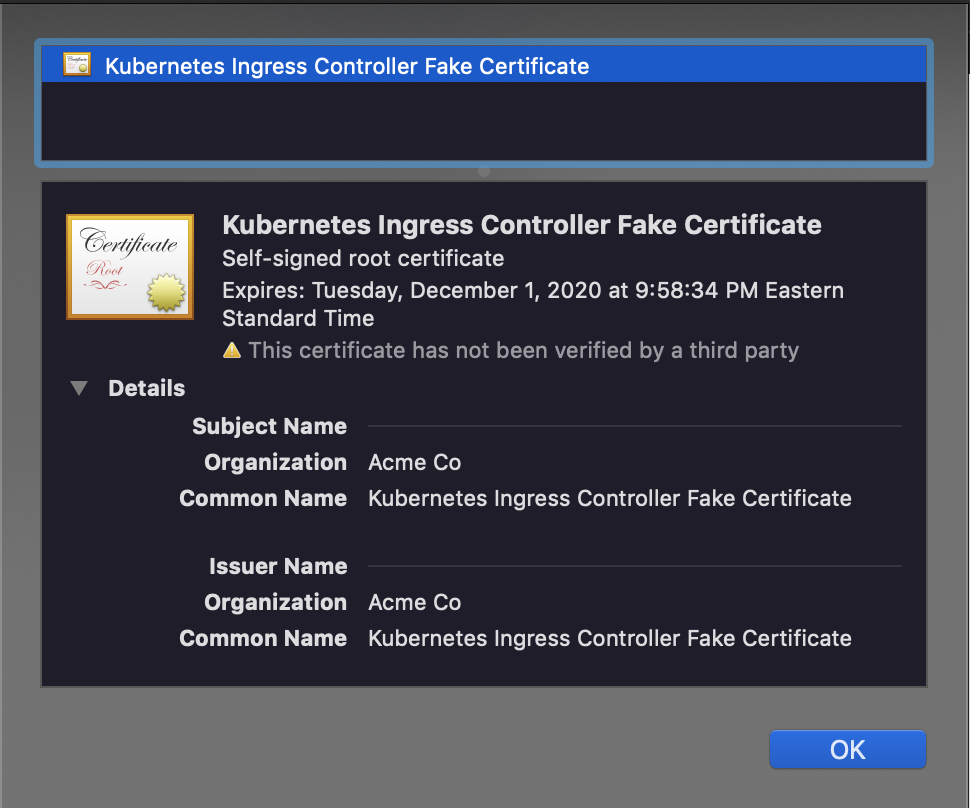

## Start
```
$ minikube start

$ minikube addons list

$ minikube addons enable ingress
```
## Check if Ingress is working
`$ kubectl get pods -n kube-system | grep ingress`

## Deploy nginx pods

`$ kubectl run nginx --image=nginx`
```
kubectl run --generator=deployment/apps.v1 is DEPRECATED and will be  removed in a future version. Use kubectl create instead.
deployment.apps/nginx created
```

## Expose the resource
`$ kubectl expose deployment nginx --port 80`
```
service/nginx exposed
```

## Create ingress.yml manifest
> Refer to the `ingress.yml` in the repo

`$ kubectl apply -f ingress.yml`
```
ingress.extensions/nginx created
```

## Add entry to your host file
`$ echo "$ (minikube ip) example.com" | sudo tee -a /etc/hosts`

## Check it
`$ curl example.com`

## Install cert-manager

1. `$ kubectl apply --validate=false -f https://raw.githubusercontent.com/jetstack/cert-manager/release-0.12/deploy/manifests/00-crds.yaml`
    ```
    customresourcedefinition.apiextensions.k8s.io/# certificaterequests.cert-manager.io created
    customresourcedefinition.apiextensions.k8s.io/# certificates.cert-manager.io created
    customresourcedefinition.apiextensions.k8s.io/# challenges.acme.cert-manager.io created
    customresourcedefinition.apiextensions.k8s.io/# clusterissuers.cert-manager.io created
    customresourcedefinition.apiextensions.k8s.io/issuers.cert-manager.io created
    customresourcedefinition.apiextensions.k8s.io/# orders.acme.cert-manager.io created
    ```
2. `$ helm repo add jetstack https://charts.jetstack.io`
    ```
    "jetstack" has been added to your repositories
    ```
3. `$ helm repo update`
    ```
    Hang tight while we grab the latest from your chart repositories...
    ...Successfully got an update from the "jetstack" chart repository
    Update Complete. ⎈ Happy Helming!⎈
    ```
4. `$ helm install cert-manager --namespace=kube-system  --set rbac.create=false jetstack/cert-manager`
    ```
    NAME: cert-manager
    LAST DEPLOYED: Mon Dec  2 22:43:53 2019
    NAMESPACE: kube-system
    STATUS: deployed
    REVISION: 1
    TEST SUITE: None
    NOTES: cert-manager has been deployed successfully!
    ```
5. `$ kubectl get crd`
    ```
    NAME                                  CREATED AT
    certificaterequests.cert-manager.io   2019-12-03T03:20:29Z
    certificates.cert-manager.io          2019-12-03T03:20:29Z
    challenges.acme.cert-manager.io       2019-12-03T03:20:29Z
    clusterissuers.cert-manager.io        2019-12-03T03:20:29Z
    issuers.cert-manager.io               2019-12-03T03:20:29Z
    orders.acme.cert-manager.io           2019-12-03T03:20:29Z
    ```

## Create Secure Key
`$ openssl genrsa -out ca.key 2048`
```
Generating RSA private key, 2048 bit long modulus
........................+++
....................................+++
e is 65537 (0x10001)
```

## Create signed cert
> refer to the `cnf` file if you're using Darwin

`$ openssl req -x509 -new -nodes -key ca.key -sha256 -subj "/CN=sampleissuer.local" -days 1024 -out ca.crt`

>  (required) if using Darwin `-extensions v3_ca -config openssl-with-ca.cnf`

## Create a kubernetes TLS Secret
`$ kubectl create secret tls ca-key-pair --key=ca.key --cert=ca.crt`
```
secret/ca-key-pair created
```

## Create an Issuer Resource
> refer to issuer.yaml

`$ kubectl apply -f issuer.yml`
```
issuer.cert-manager.io/ca-issuer created
```

`$ kubectl get issuer`
```
NAME        READY   AGE
ca-issuer   True    46s
```

## Create a Certificate resource
`$ kubectl apply -f certificate.yml`
```
certificate.cert-manager.io/example-com created
```

`$ kubectl get certificate`
```
NAME          READY   SECRET            AGE
example-com   True    example-com-tls   56s
```

`$ kubectl describe certificate example-com`

```
Events:
  Type    Reason        Age   From          Message
  ----    ------        ----  ----          -------
  Normal  GeneratedKey  108s  cert-manager  Generated a new private key
  Normal  Requested     108s  cert-manager  Created new CertificateRequest resource "example-com-1491741392"
  Normal  Issued        108s  cert-manager  Certificate issued successfully
```

## Confirm that the new secret is issued
`$ kubectl get secret`
```
NAME                  TYPE                                  DATA   AGE
ca-key-pair           kubernetes.io/tls                     2      24m
default-token-plvl8   kubernetes.io/service-account-token   3      12d
example-com-tls       kubernetes.io/tls                     3      3m15s <== is what you are looking for
```

`$ kubectl get secret example-com-tls -o yaml`
> you'll see a base64 version of the cert that was just issued.

## Double Check
Browse to : `https://example.com` 




# Further Reading
https://cert-manager.io/docs/ 
